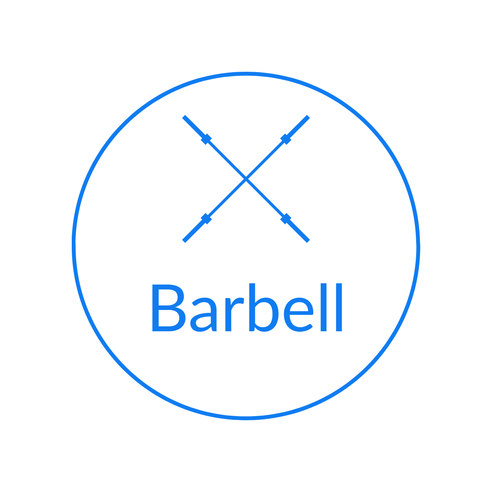

<h1 align="center">
<a href="https://www.socialbarbell.com"> Barbell</a> - Track Your Gym Progress 💪 
</h1>

  A <a href="https://www.djangoproject.com/"> Django</a> powered web application designed as a social media platform. For production, the application uses <a href="https://www.nginx.com/"> Nginx</a> as reverse proxy and <a href="https://gunicorn.org/"> Gunicorn</a> as the request server.

  Created By: <a href="https://github.com/alexfisher03"> Alexander Fisher</a> (University Of Florida) and <a href="https://github.com/jsalem5?tab=repositories"> Jonathan Salem </a> (University of Texas)

  

